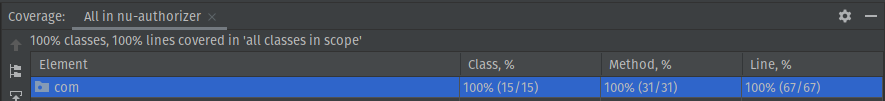

# NU AUTHORIZER STANDALONE
Software to manager an account and transactions rules.

## Context
This software was developed using a modern language programming, so I could apply code design best practice, core libs 
that I used to help myself:
- [Jackson](https://github.com/FasterXML/jackson): Deserializer and Serializer Json
- [JUnit 5](https://junit.org/junit5/): Test software
- [Mockito](https://site.mockito.org/): Mock objects in tests

I chose Clean Architecture methodology to build the code design, I could reproduce business domain in the code as a ubiquitous language and structure, I have so easily test code and
expansive software.

## Code Coverage


## Repository
- [Docker Hub](https://hub.docker.com/r/charlesluxinger/nu-authorizer)

## Technologies
- [Git & Bash](https://git-scm.com/downloads)
- [Maven 3.8.1](https://maven.apache.org/download.cgi)
- [Java 11](https://www.oracle.com/java/technologies/javase-jdk11-downloads.html)
- [Kotlin 1.5.21](https://kotlinlang.org/)
- [Docker 20.10.7](https://www.docker.com/products/docker-desktop) 
- [Docker Compose 1.29.2](https://docs.docker.com/compose/install/)


## Instructions
### - Running
1) Verify if there are dependencies installed `Docker` and `Docker Compose`, it is not necessary install `Java`, `Kotlin` and `Maven`
2) In project root directory verify if `run.sh` have run permission
   ```shell
    $ ls -la
   ```
   ```
    -rwxrwxr-x 1 user user 86 Jul 15 10:20 run.sh
   ```
   2.1) Set run permission
   ```
   chmod +x run.sh
   ```
3) In root project file execute:
   ```shell
    $ ./run.sh "FILE_PATH"
    ```
   3.1) Change `FILE_PATH` to example `assets/operations-success`

